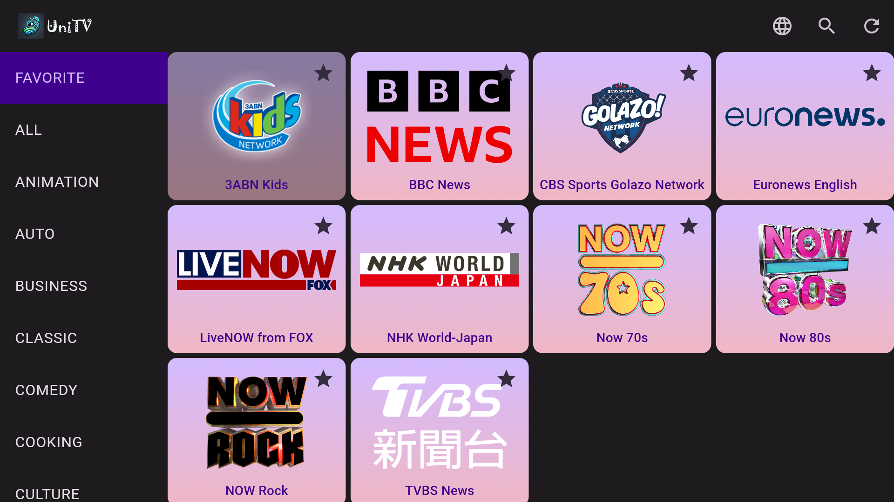
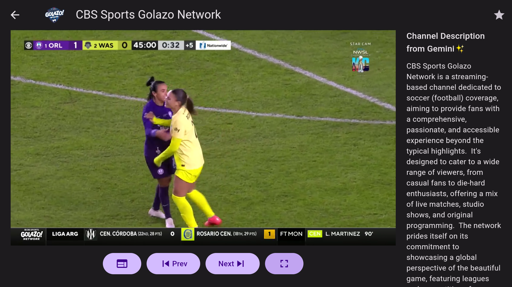
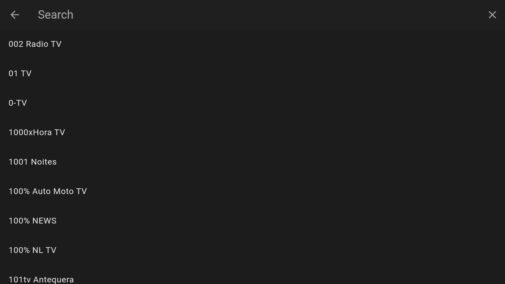

# UniTV 🌍📺

**UniTV** is a Flutter-based application that allows users to watch TV channels from any country. The app provides a seamless experience with features like remote-control integration, video playback, and an intuitive user interface.

[Google Play](https://play.google.com/store/apps/details?id=com.vinsonguo.flutter_iptv_client)
---

## 📱 Features

- Watch TV channels from all over the world.
- Smooth video playback with advanced video controls.
- Support import online m3u8 playlist url.
- Gemini AI to generate channel description.

## 🚀 Getting Started

### Prerequisites

- Flutter `3.19.6`
- Create `.env` in project root, and then set `GEMINI_KEY=YOUR GEMINI KEY`

### Run
```
flutter pub get
flutter run
```

## 📸 Screenshots





## 🤝 Contribution
Contributions are welcome! Please follow these steps:

1. Fork the repository.
2. git checkout -b feature/your-feature-name
3. git commit -m "Add your message here"
4. git push origin feature/your-feature-name
5. Open a Pull Request.

## 🌟 If you like this project, don’t forget to give it a star! ⭐
